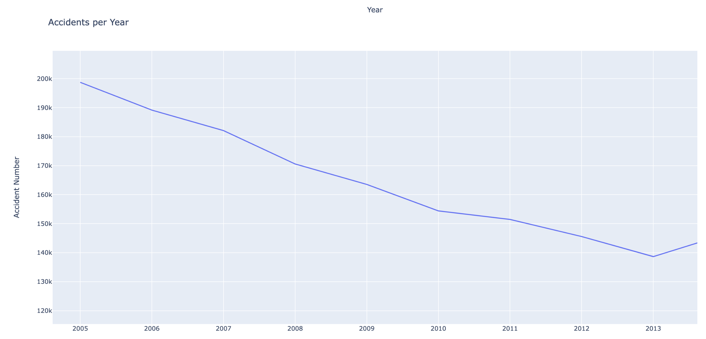

# Exploring traffic accident data through visualisations

[Link to dataset](https://www.kaggle.com/datasets/tsiaras/uk-road-safety-accidents-and-vehicles/)

**Accident count per year**

**Density of accidents in different districts in 2017**  
This is an interactive plot.  
[Click here to view the visualisation!](https://anitagat.github.io/uk_accidents_visualisation/assets/accidents_year.html)

