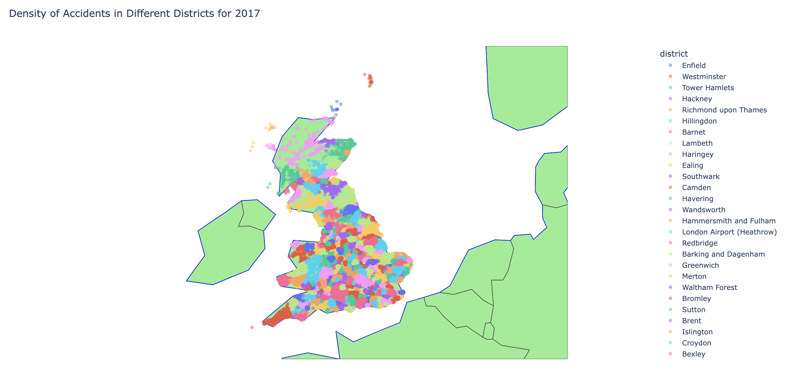

# Exploring traffic accident data through visualisations
[Link to dataset](https://www.kaggle.com/datasets/tsiaras/uk-road-safety-accidents-and-vehicles/)

## Project Overview
This repository contains an analysis of the UK Road Safety dataset, which includes data on accidents and vehicles. The project aims to explore the dataset, create interactive visualizations, and build a neural network model to predict the risk of a 'customer' being involved in an accident of 'serious','slight' and 'fatal' severity. This prediction can inform on how to determine the insurance rate.

## Data Exploration
The initial phase involves exploring the dataset using SQL to understand its structure, features, and distributions. 

### **Files:**
**queries.py**: SQL queries to explore the dataset.  
**SQLinterface.py**: A file containing the class SQLInterface, which executes and prints the output of the SQL queries. The output is then made into a Pandas dataframe to create visualisations.  
**visualisation.py**: A file containing the code to produce interactive visualisations. 
Interactive plots are created using Plotly to visualize various aspects of the dataset, such as accident severity over time and geographical distribution of accidents.

**Accident count per year**

**Density of accidents in different districts in 2017**  
This is an interactive map. Here's a screenshot displaying accident density in different districts:

[Click here to view the visualisation (slow loading due to high number of data points)](https://anitagat.github.io/uk_accidents_visualisation/assets/accidents_year.html)

## Neural Network for Accident Risk Prediction  
A neural network model is built to predict the risk of a 'customer' being involved in an accident of varying severities. The model uses features like age, sex, and vehicle details to predict the accident severity as a risk factor.  
  
**Architecture:**
Input Layer: 6 neurons  
Hidden Layers: Three layers with 64, 32, and 16 neurons  
Output Layer: 3 neurons (multi-class classification)  

### **File:**  
**neuralnetwork.py**

